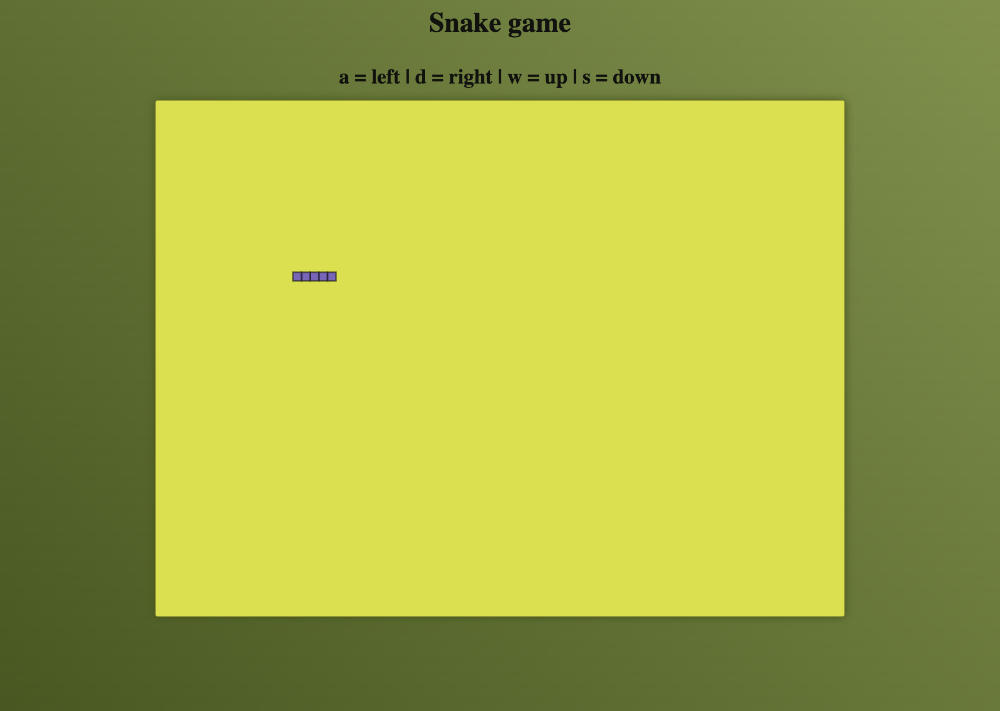

# SNAKE GAME

This is classroom coding [@ Helsinki Business College](https://www.bc.fi) with JavaScript and HTML.

## Built with

- JavaScript
- HTML
- CSS

## How to use

This is simple snake game.

Keys to use:

> **A** - left  
> **D** - right  
> **W** - up  
> **S** - down

If snake hits the wall, game is over. Snake moves faster all the time.

## What we learned

Project was part of datastructures-course and we learned to use queue DS.

## Acknowledgement

Coded together with teacher Kalwar Santosh: [original code](https://github.com/kalwar/Snake-game)

## Screenshots

